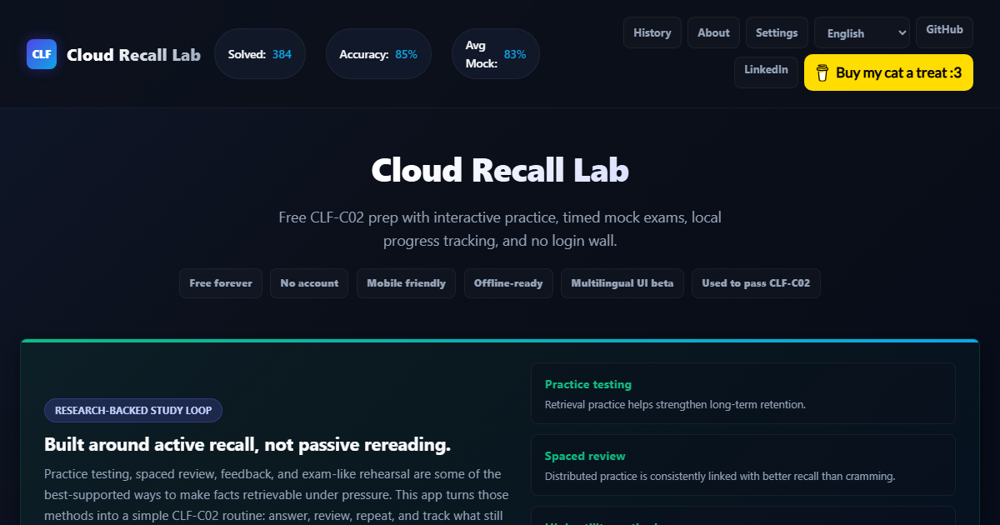

# Cloud Recall Lab

Free, zero-login CLF-C02 study app for AWS Cloud Practitioner learners. It runs as a static site, stores progress locally in the browser, and includes practice sections, timed mock exams, flashcards, serverless service maps, guided study blocks, rapid drills, and a progress history dashboard.



## Why I Built It

I used this study loop to pass the AWS Cloud Practitioner exam on July 1, 2026. My section-level score report showed Meets Competencies across all four domains, and the credential can be verified on [Credly](https://www.credly.com/badges/c52c14ed-17c7-4b4f-9c18-a0b8fc22ff6c/public_url).

I built it because too many useful study workflows were locked behind paywalls, including basics like flashcards, and generic AI/chat study flows can reveal the answer too early. This app keeps the answer hidden until you commit, then gives feedback so you can actually practice retrieval.

Udemy was also a major part of my prep. This app is best used as a free companion to current learning materials: use a course or official docs to learn, then use this hub to test whether you can retrieve the answer under pressure. The course that helped me was [Ultimate AWS Certified Cloud Practitioner CLF-C02 2026 by Stephane Maarek](https://www.udemy.com/share/103a093@rTW9shCVwsqBgznbGpMnTASN1NDXC6GC5TC1TzzT0e7cwIKNAxQ705qeV8ul3Ckjdw==/).

That result is personal proof that the loop helped me, not a promise that the app alone guarantees a pass.

## Live Demo

When published with GitHub Pages, this project can run at:

`https://josephhauter.github.io/cloud-practitioner-practice-hub/`

## Features

- 380+ original practice questions across section practice, mock exams, final pressure tests, and readiness exams
- Timed exam simulations with pass/fail scoring, flagged questions, detailed review, and wrong-answer capture
- Progress history with score trend chart, exam log, section accuracy, export/import, and reset controls
- Master memory trainer with text-to-speech, flashcards, active recall matching, and wrong-answer flashcards
- Service index with quick summaries, trigger words, and serverless badges
- Serverless map covering the exam-relevant compute, API, data, integration, and AI services
- Guided study blocks for 90, 120, or 180 minute focused study sessions
- Rapid trigger drills and a 20-question mixed mini quiz
- Local score-card PNG download for sharing results
- Mobile-friendly, keyboard-aware, reduced-motion aware, and installable as a PWA
- Multilingual interface beta for English, Spanish, Portuguese, French, German, Italian, and Dutch
- No accounts, no ads, no backend, no tracking, and no paid dependencies

Note: the interface guidance can switch languages, but the AWS service names and practice questions intentionally stay in English so exam terminology remains consistent.

## PWA and Offline Use

The app is installable as a Progressive Web App on supported browsers once it is hosted over HTTPS. After the first successful load, the app shell and practice data are cached for offline study. Progress is still stored locally in the browser, so learners should use Backup Progress before clearing site data or switching devices.

## Browser Support

Cloud Recall Lab targets current Chrome, Edge, Firefox, and Safari on desktop and mobile. The core app is vanilla HTML, CSS, and JavaScript, so modern browsers should handle practice, flashcards, progress, and local score-card downloads.

Some features depend on browser support and device settings:

- Offline install requires a browser with service worker support and an HTTPS-hosted site.
- Text-to-speech voices vary by browser and operating system.
- Native sharing and install prompts vary across iOS, Android, and desktop browsers.
- Internet Explorer is not supported.

## Study Method

The app is built around active recall rather than passive rereading:

- **Practice testing:** learners repeatedly retrieve answers instead of only reviewing notes.
- **Spaced review habits:** wrong-answer pools and progress history make it easy to revisit weak topics over time.
- **Feedback loops:** detailed review and rationales help learners correct misunderstandings quickly.
- **Exam-like rehearsal:** timed mock exams help practice under realistic pressure.

This does not guarantee a pass, but the core loop follows well-supported learning techniques. Useful references:

- Roediger & Karpicke, 2006: [Test-enhanced learning and long-term retention](https://pubmed.ncbi.nlm.nih.gov/16507066/)
- Cepeda et al., 2006: [Distributed practice review and quantitative synthesis](https://pubmed.ncbi.nlm.nih.gov/16719566/)
- Dunlosky et al., 2013: [Effective learning techniques review](https://journals.sagepub.com/doi/abs/10.1177/1529100612453266)

## Support

The app is free and open source. If it helps you pass or saves you money on paid practice exams, you can support the project here:

[Buy Me a Coffee](https://buymeacoffee.com/josephhauter)

## Analytics

Analytics are intentionally not enabled in the repo. The launch promise is no accounts, no ads, no backend, and no tracking.

If you want public usage stats after publishing, add a privacy-friendly option such as Cloudflare Web Analytics or Plausible, then update this README and the site copy so visitors know exactly what is measured. Avoid ad pixels, cross-site trackers, or anything that undermines the trust story.

## Why Static

Static is the right launch architecture for this project. It is free to host, fast on GitHub Pages or Cloudflare Pages, easy to fork, and avoids privacy/security overhead from user accounts. Progress lives in `localStorage`; users can export/import JSON if they want to move progress between browsers or devices.

## Community

Contributions and corrections are welcome. Start with [CONTRIBUTING.md](CONTRIBUTING.md), [COMMUNITY.md](COMMUNITY.md), and the GitHub issue templates. Please keep questions original and do not submit real exam questions, braindumps, paid course content, or confidential material.

## Local Use

Open `index.html` directly, or run a local static server:

```bash
python -m http.server 8765
```

Then visit `http://localhost:8765/`.

## Release Audit

Run the deterministic content and static-site checks before publishing:

```bash
node tools/release-audit.js
```

This validates question counts, duplicate IDs, answer keys, exam-mode expectations, core assets, CSP basics, and common static-site regressions.

The audit also checks the PWA manifest, service worker cache version, core offline assets, and community files required for public launch.

## Publishing

1. Create a public GitHub repo named `cloud-practitioner-practice-hub`.
2. Push these files to the repo.
3. In GitHub, go to Settings -> Pages.
4. Choose "Deploy from a branch", select `main`, and use `/ (root)`.
5. Share the live URL and repo URL in your LinkedIn post.

## Contributing Questions

Question contributions are welcome. Please make sure every question is original, scenario-based, and not copied from real exams, braindumps, paid practice products, or AWS confidential materials.

Use this shape:

```js
{
  id: 9999,
  section: 1,
  question: "A company wants to ... Which AWS service should they use?",
  options: ["A. ...", "B. ...", "C. ...", "D. ..."],
  answer: "B",
  explanation: "Explain why the answer is correct.",
  rationale: [
    "A: Why this is wrong.",
    "B: Why this is correct.",
    "C: Why this is wrong.",
    "D: Why this is wrong."
  ]
}
```

## Disclaimer

This is an independent study tool and is not affiliated with, endorsed by, or sponsored by Amazon Web Services (AWS). AWS, Amazon, and the AWS logo are trademarks of Amazon.com, Inc. All questions are original practice scenarios created for educational purposes.

AWS can update certification scope, service behavior, and exam wording over time. Always cross-check the current AWS CLF-C02 exam guide, AWS documentation, and up-to-date course material before taking the real exam.

## Author

Built by [Joseph Hauter](https://www.linkedin.com/in/josephhauter/). GitHub: [@josephhauter](https://github.com/josephhauter). Support: [Buy Me a Coffee](https://buymeacoffee.com/josephhauter).

## License

MIT
